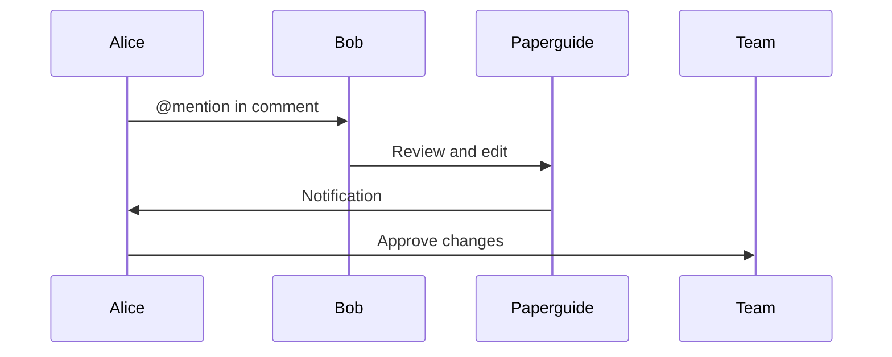

## Inviting Team Members

You invite collaborators by sharing space links or adding emails directly. Set roles like editor or viewer to control contributions. This fosters secure, efficient teamwork without external tools.

<Columns cols={2}>
  <Card title="Role Management" icon="users" href="#">
    Assign permissions at granular levels for safety.
  </Card>
  <Card title="Real-time Editing" icon="edit" href="#">
    Multiple users edit simultaneously with live updates.
  </Card>
</Columns>

<Steps>
  <Step title="Add Users" icon="user-plus">
    Go to space settings and enter emails to send invites.
  </Step>
  <Step title="Set Roles" icon="shield">
    Choose from admin, editor, or reader based on needs.
    
    <Callout kind="tip">
      Start with viewer roles for new members to review before editing.
    </Callout>
  </Step>
  <Step title="Collaborate" icon="message-circle">
    Use comments and mentions to discuss changes inline.
  </Step>
</Steps>

## Workflow Integration

Integrate Paperguide with Slack or GitHub for notifications on updates. You automate approvals for sensitive docs.

<Tabs>
  <Tab title="Comments" icon="message-square">
    Thread discussions on specific sections for focused feedback.
    
    ```javascript
    // Post a comment via API
    const addComment = async (pageId, text) => {
      await fetch(`/api/pages/${pageId}/comments`, {
        method: 'POST',
        body: JSON.stringify({ text }),
      });
    };
    ```
  </Tab>
  <Tab title="Mentions" icon="at-sign">
    Notify users with `@username` in text for quick alerts.
    
    <Expandable title="Mention Best Practices">
      Use sparingly to avoid notification fatigue.
    </Expandable>
  </Tab>
</Tabs>

<CodeGroup tabs="Slack,Email">
  ```javascript
  // Slack webhook integration
  const notifySlack = async (message) => {
    await fetch('https://hooks.slack.com/services/your/webhook', {
      method: 'POST',
      body: JSON.stringify({ text: message }),
    });
  };
  ```
  ```javascript
  // Email notification
  const sendEmail = async (to, subject, body) => {
    await fetch('/api/notifications/email', {
      method: 'POST',
      body: JSON.stringify({ to, subject, body }),
    });
  };
  ```
</CodeGroup>

## Review and Approval

Implement peer reviews using draft modes. You track changes and merge contributions like in code repos.

<Callout kind="success">
  Enable history to see who edited what and when.
</Callout>

## Best Practices

Encourage regular syncs and clear guidelines. You use templates for consistent style across contributions.

| Role | Permissions | Use Case |
|------|-------------|----------|
| Admin | Full access | Project leads |
| Editor | Edit pages | Contributors |
| Viewer | Read only | Stakeholders |

<ExpandableGroup>
  <Expandable title="Handling conflicts?">
    Resolve via discussion threads or version rollback.
  </Expandable>
  <Expandable title="External collaborators?">
    Use guest access with limited scopes for partners.
  </Expandable>
</ExpandableGroup>



These features make Paperguide ideal for distributed teams, ensuring smooth collaboration on documentation.