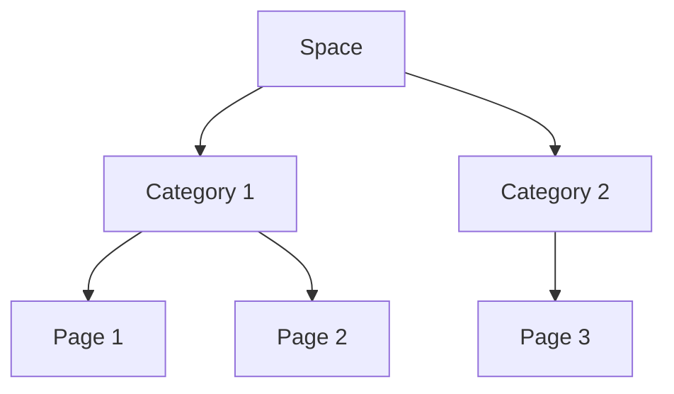

## Structuring Your Space

You organize documentation by creating a logical hierarchy of spaces and pages. Start with top-level categories like `API Reference` or `User Guides` to make navigation intuitive. This approach scales as your project grows.

<Columns cols={3}>
  <Card title="Hierarchies" icon="layers" href="#">
    Nest pages under sections for clear paths.
  </Card>
  <Card title="Tagging" icon="tag" href="#">
    Apply labels for quick filtering and search.
  </Card>
  <Card title="Search Optimization" icon="search" href="#">
    Use keywords to enhance discoverability.
  </Card>
</Columns>

<Steps>
  <Step title="Define Categories" icon="menu">
    Outline main sections based on user needs, such as onboarding or troubleshooting.
  </Step>
  <Step title="Create Pages" icon="file-text">
    Add content pages within categories, linking related topics.
    
    ```javascript
    // API example for creating a page
    const createPage = async (spaceId, title, content) => {
      const response = await fetch(`/api/spaces/${spaceId}/pages`, {
        method: 'POST',
        headers: { 'Content-Type': 'application/json' },
        body: JSON.stringify({ title, content }),
      });
      return response.json();
    };
    ```
  </Step>
  <Step title="Link and Tag" icon="link">
    Connect pages and add tags for better cross-referencing.
  </Step>
</Steps>

## Maintenance Practices

Regularly review and update your docs to keep them relevant. You schedule audits or use webhooks for automated checks.

<Tabs>
  <Tab title="Version Control" icon="git-branch">
    Enable history tracking to revert changes easily.
    
    <Callout kind="alert">
      Avoid breaking links during updates by using redirects.
    </Callout>
  </Tab>
  <Tab title="Audits" icon="check-circle">
    Run periodic reviews to ensure accuracy and completeness.
    
    ```python
    # Script to check broken links
    import requests
    def check_links(urls):
        for url in urls:
            response = requests.head(url)
            if response.status_code != 200:
                print(f'Broken: {url}')
    ```
  </Tab>
</Tabs>

<CodeGroup tabs="Markdown,JSON">
  ```markdown
  # Page Structure Example
  ## Section 1
  Content here.
  
  ## Section 2
  More details.
  ```
  ```json
  // Page metadata
  {
    "title": "Guide",
    "tags": ["guide", "api"],
    "status": "published"
  }
  ```
</CodeGroup>

## Advanced Organization

For large teams, you implement templates and workflows. Share reusable page layouts to standardize formatting across docs.



<ExpandableGroup>
  <Expandable title="How to handle duplicates?">
    Merge similar pages and redirect old links to the canonical version.
  </Expandable>
  <Expandable title="Bulk operations?">
    Use the API or CLI for importing and tagging multiple files at once.
  </Expandable>
</ExpandableGroup>

| Organization Level | Best Practice | Benefit |
|--------------------|---------------|---------|
| Space | One per project | Isolation |
| Category | 5-10 max | Navigation ease |
| Page | `<1000` words | Readability |

By following these strategies, you maintain clean, scalable documentation that supports your team's efficiency.